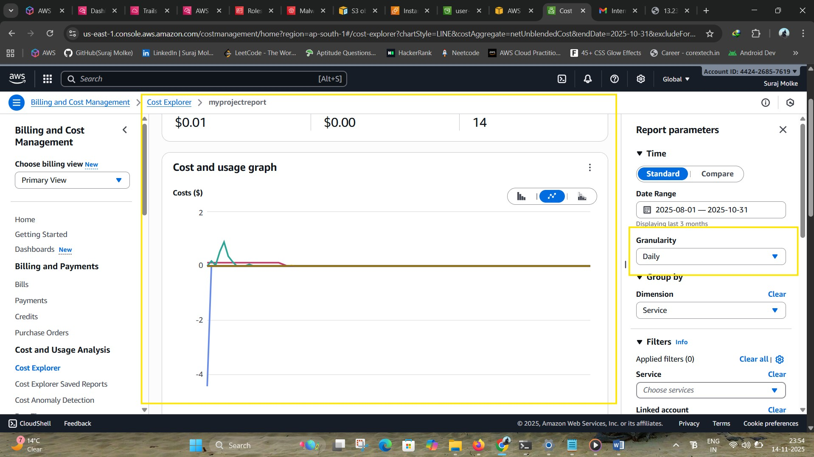
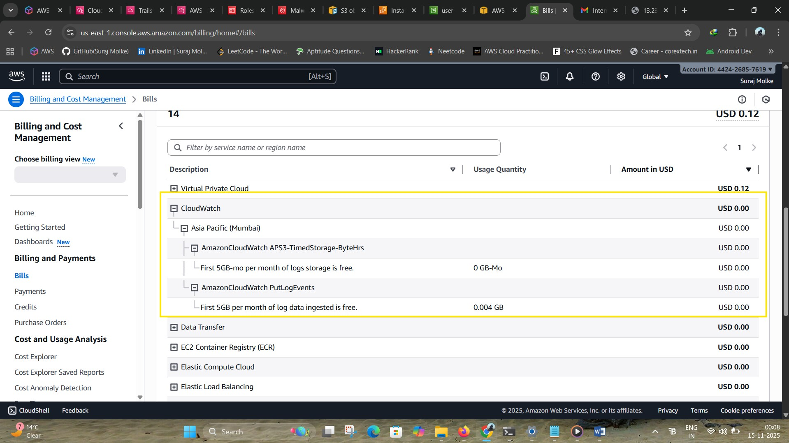
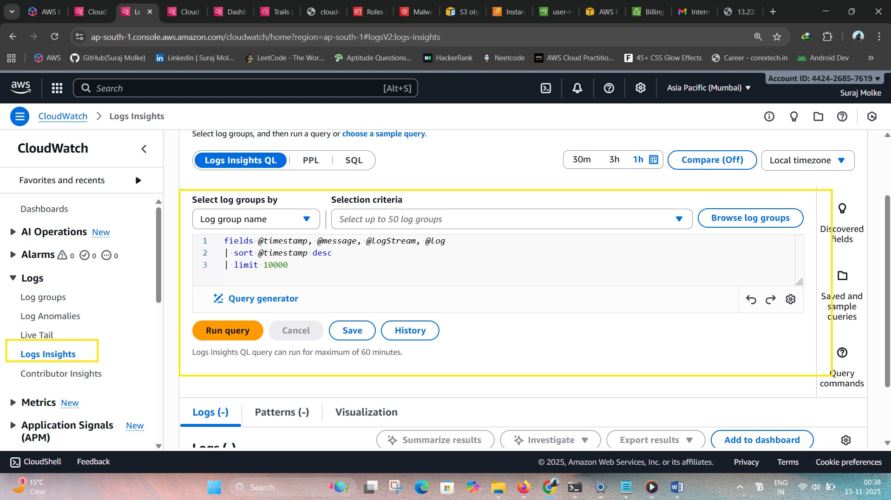
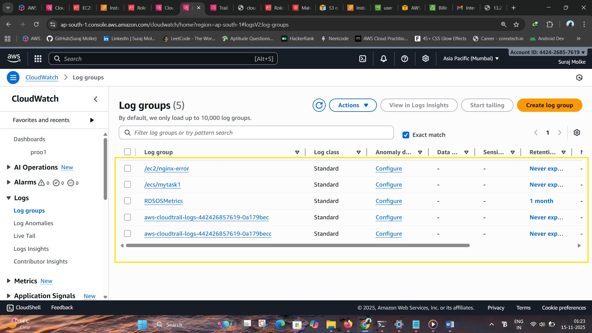

# 📘 AWS CloudWatch Dashboards for Comprehensive Monitoring

## 📝 Project Details

**Project:** AWS CloudWatch Dashboards for Comprehensive Monitoring\
**Batch:** MCA 7 Feb 2025 & DevOps 2 Jun 2025\
**Student:** Suraj Molke\
**Mentors:** Ravindra Bagle Sir, Swati Zampal Ma'am\
**Institute:** Fortune Cloud Technologies, Pune

------------------------------------------------------------------------

# 🌟 Overview

This project builds **four comprehensive AWS CloudWatch Dashboards** to
monitor:

-   **Billing & Cost**
-   **System & Application Logs**
-   **Network Traffic**
-   **Security & Compliance**

The solution uses only native AWS services --- **no Lambda**, **no
external tools**, making it efficient and cost-effective.

An EC2 instance is configured with **CloudWatch Agent** to push system
logs, application logs, and NGINX logs. Additional AWS services such as
GuardDuty, AWS Config, and CloudTrail strengthen the monitoring setup.

------------------------------------------------------------------------

# Diagram


------------------------------------------------------------------------

# 🧩 AWS Services Used

-   **Amazon CloudWatch**
    -   Dashboards\
    -   Metrics\
    -   Logs\
    -   Logs Insights\
-   **AWS Config** (Compliance)\
-   **AWS GuardDuty** (Threat detection)\
-   **AWS CloudTrail** (API monitoring)\
-   **IAM** (Access control)\
-   **EC2** (Log source)\
-   **S3** (AWS Config log storage)\
-   **Application Load Balancer** (Traffic generation)

------------------------------------------------------------------------

# 🎯 Objective

Build end-to-end CloudWatch dashboards that provide:

-   Cost visibility\
-   System & application log monitoring\
-   VPC flow-based network tracking\
-   Security events & compliance metrics

------------------------------------------------------------------------

# 📊 1. Billing & Cost Dashboard

## ✔️ Step 1: Enable Billing Tools

1.  Go to **Billing → Cost Management**\
2.  Enable **Cost Explorer**


## ✔️ Step 2: Create Reports in Cost Explorer

### **2.1 Total Cost Over Time**

-   Granularity: Daily\
-   Metric: Unblended Cost\
-   Group by: None

### **2.2 Daily Estimated Charges by Service**

-   Granularity: Daily\
-   Group by: Service (EC2, S3, RDS, ...)

### **2.3 Monthly Cost Breakdown**

-   Granularity: Monthly\
-   Group by: Service

📌 Add generated charts to the dashboard.

------------------------------------------------------------------------

# 📁 2. Application & System Logs Monitoring

## ✔️ Step 3: Configure CloudWatch Agent on EC2

Install CloudWatch Agent:

``` bash
sudo yum install amazon-cloudwatch-agent -y
sudo nano /opt/aws/amazon-cloudwatch-agent/bin/config.json
```

Sample config:

``` json
{
  "logs": {
    "logs_collected": {
      "files": {
        "collect_list": [
          { "file_path": "/var/log/messages", "log_group_name": "system-logs" },
          { "file_path": "/var/log/nginx/error.log", "log_group_name": "nginx-logs" }
        ]
      }
    }
  }
}
```

Start the agent:

``` bash
sudo systemctl start amazon-cloudwatch-agent
```

------------------------------------------------------------------------

## ✔️ Step 4: Use CloudWatch Logs Insights

Navigate to:\
**CloudWatch → Logs → Log Insights**

Example queries:

### 🔹 Rejected Traffic

``` sql
fields srcAddr, dstPort, action, bytes
| filter action="REJECT"
| sort bytes desc
```

### 🔹 Access Denied API Calls

``` sql
fields eventName, userIdentity.arn, sourceIPAddress
| filter errorCode="AccessDenied"
| sort @timestamp desc
```

------------------------------------------------------------------------

## ✔️ Step 5: Add Logs Widgets to Dashboard

Add widgets:

-   Query Results Table\
-   Line Graph (response times)\
-   Bar Chart (error counts)\
-   Numeric Widget (errors in last 1 hr)

------------------------------------------------------------------------

# 🖥️ 3. System Logs Details

### **/var/log/messages**

Contains OS-level system logs:\
- Kernel logs\
- Service restarts\
- Network issues\
- Authentication events

### **/var/log/nginx/error.log**

Contains:\
- HTTP errors\
- Upstream failures\
- Bad gateway (502/504) events

Example advanced agent config:

``` json
{
  "logs": {
    "logs_collected": {
      "files": {
        "collect_list": [
          {
            "file_path": "/var/log/messages",
            "log_group_name": "/ec2/system-messages",
            "log_stream_name": "{instance_id}-messages",
            "timestamp_format": "%b %d %H:%M:%S"
          },
          {
            "file_path": "/var/log/nginx/error.log",
            "log_group_name": "/ec2/nginx-error",
            "log_stream_name": "{instance_id}-nginx-error",
            "timestamp_format": "%Y/%m/%d %H:%M:%S"
          }
        ]
      }
    }
  }
}
```

------------------------------------------------------------------------

# 🌐 4. Network Monitoring Dashboard

## ✔️ Step 7: VPC Flow Logs

Enable from:\
**VPC → Flow Logs → Create Flow Log**

Send logs to **CloudWatch Logs**.

Useful query:

``` sql
fields srcAddr, dstPort, action, bytes
| filter action="REJECT"
| sort bytes desc
```


------------------------------------------------------------------------

## ✔️ Step 7.1: EC2 Network Metrics

Monitor:

-   NetworkIn\
-   NetworkOut\
-   NetworkPacketsIn\
-   NetworkPacketsOut\
-   StatusCheckFailed

To generate traffic:\
✔ Deploy **NGINX**\
✔ Attach an **Application Load Balancer**

------------------------------------------------------------------------

# 🔐 5. Security Monitoring Dashboard

## ✔️ Step 8.1: GuardDuty Monitoring

Enable GuardDuty & add widgets:

-   Findings Over Time\
-   High Severity Threats\
-   Activity breakdown

------------------------------------------------------------------------

## ✔️ Step 8.2: AWS Config (Compliance Monitoring)

Enable AWS Config:\
- Choose required resources\
- Save logs to S3

Metrics to monitor:

-   NonCompliantResourceCount\
-   ComplianceStatus

Dashboard widgets:\
- Number widget\
- Gauge widget

------------------------------------------------------------------------

## ✔️ Step 8.3: CloudTrail Monitoring (API Activity)

CloudTrail records help detect:

-   Unauthorized access\
-   Resource deletions\
-   Suspicious activity

Useful query:

``` sql
fields eventName, userIdentity.arn, sourceIPAddress
| filter errorCode = "AccessDenied"
| sort @timestamp desc
```

------------------------------------------------------------------------

## ✔️ Step 8.4: IAM Security Monitoring

Monitor:

-   Unauthorized API calls\
-   Access key usage\
-   Password policy compliance

Query:

``` sql
fields userIdentity.userName, eventName, errorCode, sourceIPAddress
| filter errorCode like /AccessDenied/
| sort @timestamp desc
```

------------------------------------------------------------------------

# 🏁 Conclusion

This project delivers a complete, scalable, low-cost AWS monitoring
solution using CloudWatch Dashboards.
# AWS-CloudWatch-Dashboards-for-Comprehensive-Monitoring-
